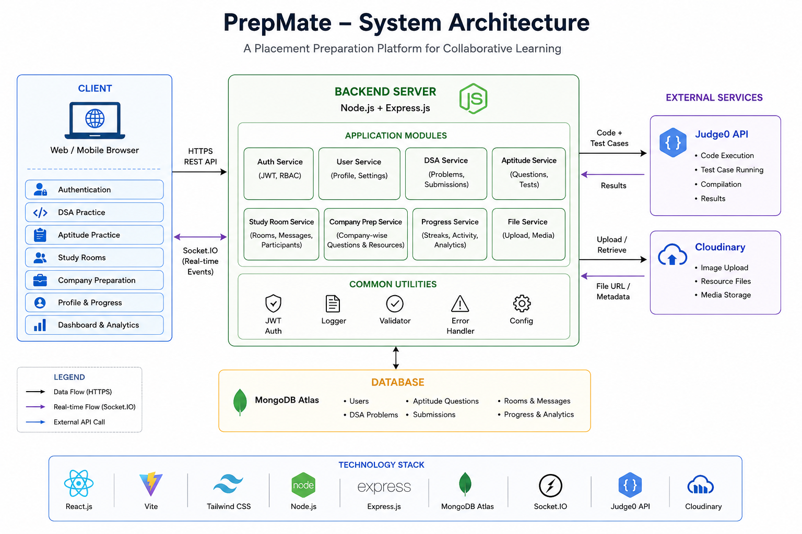
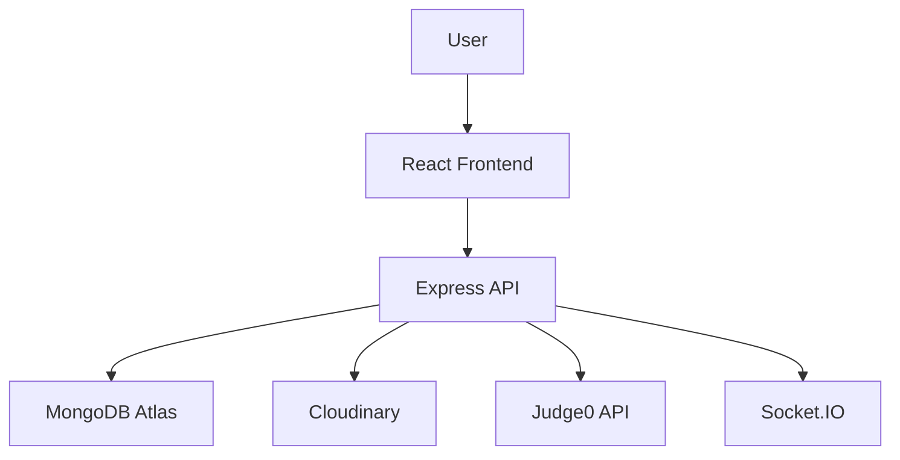
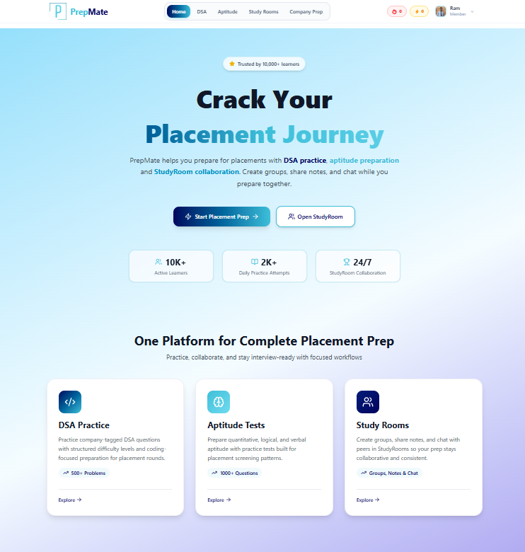
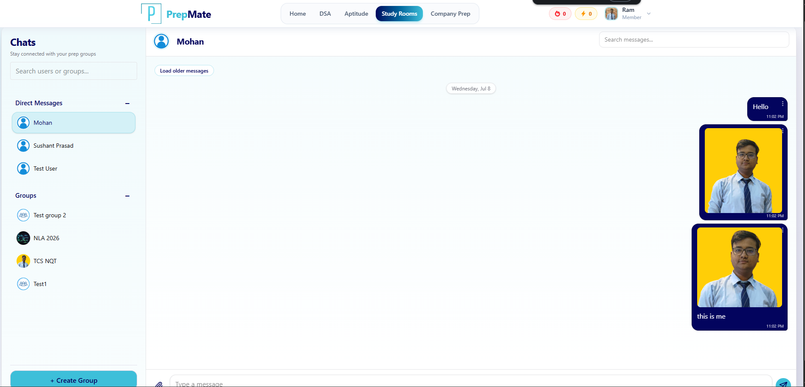
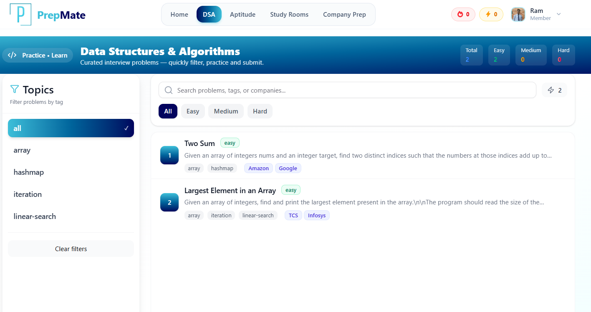
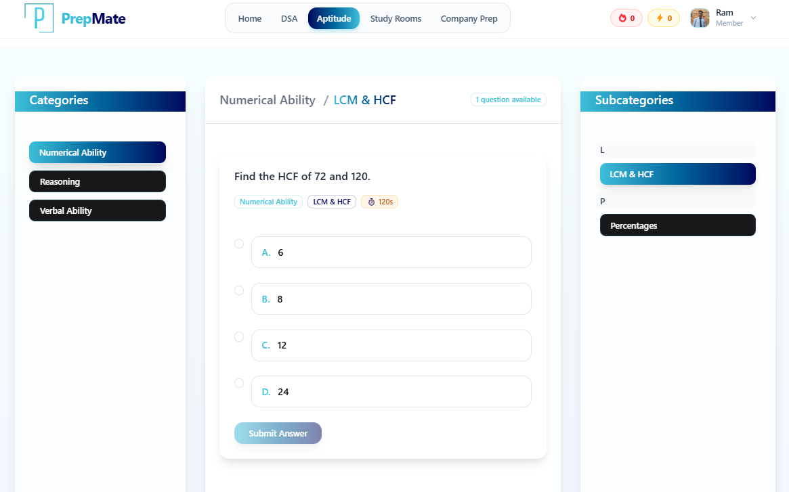
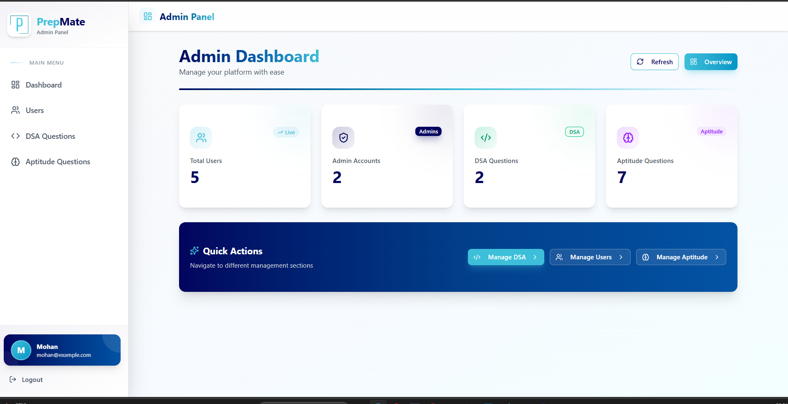

# PrepMate 🚀

PrepMate is a collaborative placement preparation platform built with the MERN stack. It helps students prepare for campus placements through DSA practice, aptitude preparation, company-specific learning, and real-time Study Rooms for teamwork, notes, and discussion.

## 1. Project Description

PrepMate is designed to bring everything a student needs for placement preparation into one platform.

- Practice DSA problems in a code editor powered by Monaco Editor and Judge0 API.
- Solve aptitude questions with instant evaluation.
- Learn company-specific coding and aptitude questions.
- Join Study Rooms for real-time group chat and collaboration.
- Track DSA and aptitude streaks.
- Manage profile details and profile photo.
- Use an admin dashboard to manage questions and users.

## 2. Features

- 🔐 JWT-based user authentication
- 👨‍💻 DSA practice with Monaco Editor and Judge0 API
- 🧠 Aptitude practice with instant scoring and solutions
- 🏢 Company-specific coding and aptitude preparation
- 💬 Study Rooms with real-time group chat using Socket.IO
- 📝 Note and resource sharing in groups
- 🔥 DSA and Aptitude streak tracking
- 👤 User profile page with photo upload/delete
- 🛠️ Admin dashboard
- CRUD for DSA and aptitude questions
- Cloudinary-based image upload and management

## 3. Tech Stack

| Layer | Technologies |
|---|---|
| Frontend | React.js, Vite, Tailwind CSS, React Query, React Router, Axios, Monaco Editor |
| Backend | Node.js, Express.js, JWT Authentication, Socket.IO |
| Database | MongoDB Atlas, Mongoose |
| APIs & Services | Judge0 API, Cloudinary |

## 4. System Architecture




### High-level flow



## 5. Folder Structure

```text
PrepMate-MERN/
├── Client/
│   ├── src/
│   │   ├── components/
│   │   ├── context/
│   │   ├── layouts/
│   │   ├── pages/
│   │   ├── services/
│   │   └── utils/
│   ├── public/
│   └── package.json
├── Server/
│   ├── controllers/
│   ├── middleware/
│   ├── models/
│   ├── routes/
│   ├── utils/
│   ├── public/
│   └── package.json
└── README.md
```

## 6. Installation Steps

### Prerequisites

- Node.js
- npm
- MongoDB Atlas account
- Cloudinary account
- Judge0 API access

### Clone the repository

```bash
git clone <https://github.com/Sushant-Prasad/PrepMate-MERN>
cd PrepMate-MERN
```

### Install backend dependencies

```bash
cd Server
npm install
```

### Install frontend dependencies

```bash
cd ../Client
npm install
```

## 7. Environment Variables

Create a `.env` file inside both `Server/` and `Client/` as needed.

### Server `.env`

```env
PORT=3001
MONGODB_URI=your_mongodb_atlas_connection_string
JWT_SECRET=your_jwt_secret
CLIENT_URL=http://localhost:5173
CLOUDINARY_CLOUD_NAME=your_cloudinary_cloud_name
CLOUDINARY_API_KEY=your_cloudinary_api_key
CLOUDINARY_API_SECRET=your_cloudinary_api_secret
JUDGE0_API_URL=your_judge0_api_url
JUDGE0_API_KEY=your_judge0_api_key
```

### Client `.env`

```env
VITE_API_URL=http://localhost:3001/api
```

## 8. Running the Project

### Start the backend

```bash
cd Server
npm run dev
```

### Start the frontend

```bash
cd Client
npm run dev
```

### Default local URLs

| Service | URL |
|---|---|
| Frontend | http://localhost:5173 |
| Backend | http://localhost:3001 |

## 9. Screenshots


### Home Page



### Study Rooms



### DSA Practice



### Aptitude Practice



### Admin Dashboard



## 10. Future Enhancements

- 📈 Advanced analytics dashboard for student progress
- 🏁 Timed mock assessments and contests
- 🤖 AI-based question recommendations
- 📚 Personalized study plans
- 🔔 Push notifications and reminders
- 📱 Mobile app support
- 🌍 Public study room discovery and join requests

## 11. Contributors

- Sushant Prasad
- Kazi Salman Ali
- Purba Choudhury

